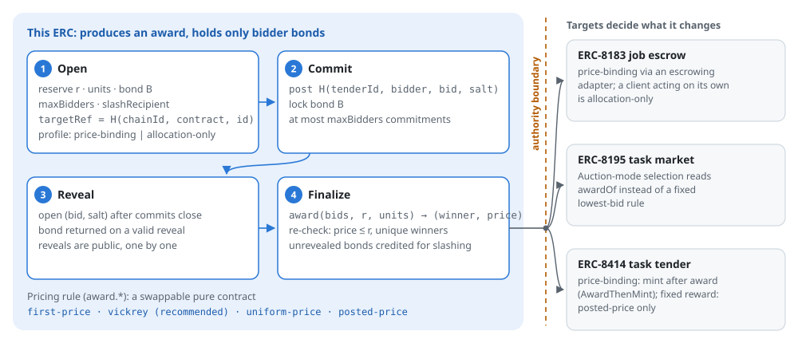
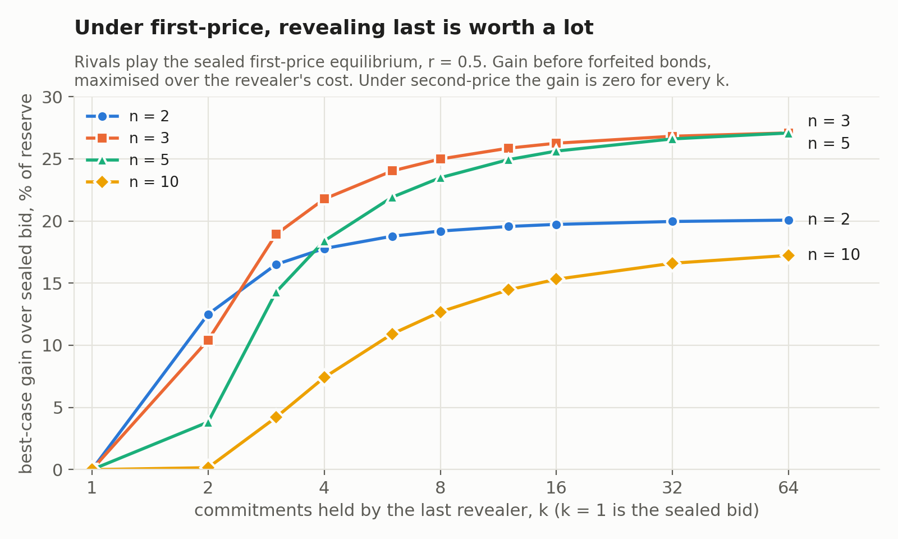

<div align="center">

# Sealed-Bid Award Mechanism for Task Tenders

**Who wins a task, and at what price — a draft ERC for agent task markets on Ethereum.**

[](https://github.com/shentonyan/sealed-bid-award-erc/actions/workflows/ci.yml)
[](https://ethereum-magicians.org/t/sealed-bid-award-mechanism-for-task-tenders-companion-to-erc-8183-8195-8414/29814)
[](src/)
[](proofs/VickreyTruthful.lean)
[](LICENSE.md)

[Draft ERC](erc/erc-draft_sealed_bid_award.md) ·
[Discussion](https://ethereum-magicians.org/t/sealed-bid-award-mechanism-for-task-tenders-companion-to-erc-8183-8195-8414/29814) ·
[Reference contracts](src/) ·
[Proof](proofs/) ·
[Analysis](analysis/)

</div>

<br>

<picture>
  <source media="(prefers-color-scheme: dark)" srcset="docs/flow-dark.svg">
  
</picture>

Three task-escrow standards — [ERC-8183](https://eips.ethereum.org/EIPS/eip-8183),
[ERC-8195](https://ethereum-magicians.org/t/erc-8195-task-market-protocol/27935) and
[ERC-8414](https://ethereum-magicians.org/t/erc-8414-token-bound-task-tenders/29597) —
let an agent post a task, escrow the reward and pay on delivery. None of them says how to
choose among several agents who want the same task. This proposal fills only that gap: a
sealed-bid award that any of the three can consume, without holding task funds or acting on
the task.

> **Status.** Pre-ERC community draft. The ERC number is assigned by the EIP editors when the
> PR to [ethereum/ERCs](https://github.com/ethereum/ERCs) is opened; this repository does not
> claim one. Once that PR exists it is the normative text, and `erc/` is a mirror.

## What it specifies

1. **A sealed-bid procedure.** Commit, reveal, finalize. A bond is returned on reveal and
   slashed if a commitment is never opened.
2. **A stateless mechanism interface.** `award(bids, reserve, units) → [(winner, price)]`,
   with six conditions every rule must satisfy, including monotonicity and a fixed tie rule.
3. **Three normative pricing rules.** `award.first-price`, `award.vickrey` (recommended) and
   `award.uniform-price`, each a swappable pure contract.
4. **One canonical target reference and an authority boundary.** An award names its target as
   `keccak256(abi.encode(chainId, targetContract, targetId))`, and confers no authority over it.

## Why second-price is the default

The design follows Myerson (1981), *Optimal Auction Design*, read as a procurement problem.
The revelation principle fixes the interface shape. Revenue equivalence says a standard only
needs to fix the allocation rule and the reserve. The second-price payment rule needs no
beliefs about other bidders' costs.

Running the auction on a public chain adds a reason specific to Ethereum. Reveals are public
and arrive one by one, so a bidder who reveals last can hold several commitments and open
only the best one. Under first-price that is worth a great deal. Under second-price it is
worth nothing, because truthful bidding is optimal whatever the others bid.

<picture>
  <source media="(prefers-color-scheme: dark)" srcset="analysis/fig2_ladder_dark.png">
  
</picture>

The full numbers, including the value of the reserve and the effect of phantom commitments,
are in [`analysis/`](analysis/). The dominance property is proved for all inputs in
[`proofs/VickreyTruthful.lean`](proofs/VickreyTruthful.lean).

## What is checked, and where

Every push runs all three in [CI](.github/workflows/ci.yml).

| Check | What it covers |
| --- | --- |
| `npm test` | Golden vectors; the six `award` conditions over an exhaustive 3-bidder grid; Vickrey dominance by brute force; the full tender lifecycle; the ERC-8414 adapter end to end |
| `forge test` | The same lifecycle in Foundry, fuzzed monotonicity and truthfulness, and regression tests for the bidder cap, rejecting slash recipients and USDT-style bond tokens |
| `lean proofs/VickreyTruthful.lean` | Truthful bidding is weakly dominant under `award.vickrey`, for any reserve, any number of bidders in any commit order, and any deviation; no `sorry`, standard axioms only |

## Quick start

```bash
npm ci && npm test                                   # no Foundry needed
git clone --depth 1 https://github.com/foundry-rs/forge-std lib/forge-std && forge test
lean proofs/VickreyTruthful.lean                     # any Lean 4 toolchain; tested on v4.34.0
```

The same commands work in Windows PowerShell; run them one per line.

## Repository layout

| Path | What it is |
| --- | --- |
| [`erc/`](erc/) | The draft ERC text |
| [`assets/erc-draft_sealed_bid_award/`](assets/erc-draft_sealed_bid_award/) | Exactly what goes into the ERCs PR: interfaces, reference contracts, test vectors |
| [`src/`](src/) | The same contracts as the working source, plus [`adapters/AwardGatedVerifier.sol`](src/adapters/AwardGatedVerifier.sol) for ERC-8414 |
| [`vectors/`](vectors/) | Golden vectors: bids in commit order, reserve, units, expected award per rule |
| [`test/`](test/) | Foundry and JS suites, and test-only mocks |
| [`proofs/`](proofs/) | The Lean proof and how to check it |
| [`analysis/`](analysis/) | Scripts, results and charts for the commit–reveal analysis |
| [`docs/`](docs/) | The diagram above and the script that draws it |

## Design notes

**`SealedBidTender`** holds bidder bonds only. It never holds the task reward, judges a
deliverable, writes reputation, or acts on the target. On `finalize` it calls the tender's
mechanism, re-checks the result against the ERC's conditions, stores the award, and credits
unopened bonds for slashing. Three properties keep it robust:

- **Bounded bidders.** Each tender sets `maxBidders`, capped at 256. `finalize` sorts bids,
  so its cost grows quadratically. It is about 8M gas at the cap, against 31M at 512 and
  122M at 1,024 without one. A bond alone does not stop flooding, because revealing returns it.
- **Pull-based slashing.** Slashed bonds are credited at `finalize` and paid by
  `claimSlashed`, so a `slashRecipient` that rejects payment cannot block the award.
- **Tolerant ERC-20 handling.** Bond transfers accept tokens that return no value, such as
  USDT. Fee-on-transfer and rebasing tokens are rejected.

**Mechanism contracts** are pure. Bids reach them in commit order, and a stable sort is
what makes "ties go to the earlier commit" hold.

**`AwardGatedVerifier`** sits in an ERC-8414 task's acceptance-authority slot. It pays only
when an inner work verifier accepts the submission *and* the fulfiller won the bound tender.
The payout stays the task's fixed `rewardPerCompletion`; the award decides who may be paid,
not how much.

## Contributing

Discussion of the design belongs in the
[Magicians thread](https://ethereum-magicians.org/t/sealed-bid-award-mechanism-for-task-tenders-companion-to-erc-8183-8195-8414/29814).
Issues and pull requests for the code, tests and proof are welcome here.

## Star history

<a href="https://star-history.com/#shentonyan/sealed-bid-award-erc&Date">
  <picture>
    <source media="(prefers-color-scheme: dark)" srcset="https://api.star-history.com/svg?repos=shentonyan/sealed-bid-award-erc&type=Date&theme=dark">
    
  </picture>
</a>

## License

Everything in this repository is released under [CC0 1.0](LICENSE.md), matching the ERC process.
